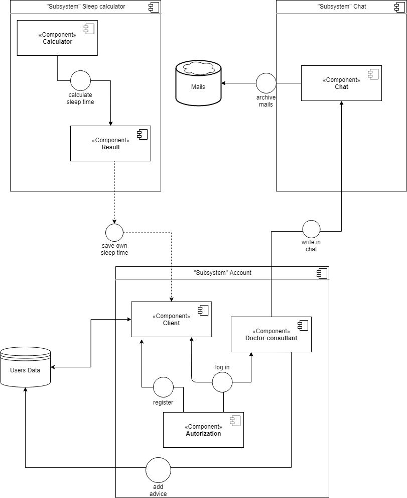

# Sleep Calculator
System/Software design

#### 1. Development view

#### 2. API design guideline
- Protocol: HTTP
- Data format: JSON
- REST API

- Single nouns for single element, plurals for collections of elements
- No versioning included to project. 
API design of this project does not contain any non-standart API methods.
Standart HTTP methods, used for API: GET, POST, DELETE.
##### GET
* uses URL params for request;
* returns status 200 if success and response body (JSON);
* returns status 404 if resource not found.
##### POST
* has a request body (JSON);
* returns status 201 if resource was created successfuly and URL for accessing resource;
* returns status 400 if user puts invalid data to request.
##### DELETE
* uses URL params for request;
* returns status 204 if resource was created successfuly;
* returns status 404 if resource not found.
#### 3. API design
Based on: https://www.merixstudio.com/blog/best-practices-rest-api-development/

Swagger documentation - check out swagger.yml
#### Run application
1. npm install in service repository
2. npm install in server repository
3. run service with "npm start"
4. run server with "node server"
5. enjoy ;)
